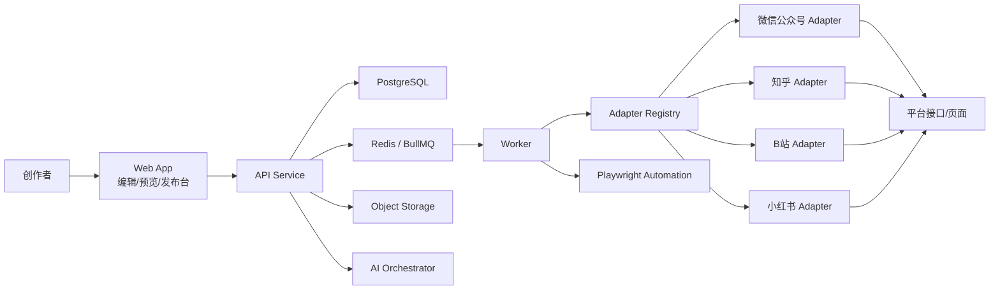
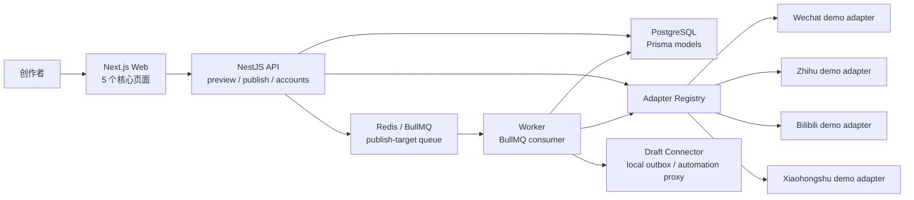

# 多平台内容同步发布工具架构设计

## 0. 当前实现快照（2026-05-30）

当前工程已经从“架构建议”推进到一个具备持久化任务链路的 MVP 工作台。创作、预览、模拟发布、任务推进、账号状态这些关键交互已经跑通，并且发布任务已从 `.runtime` 文件状态升级为 PostgreSQL + Prisma 数据模型和 Redis + BullMQ 队列。

已落地：

- **Monorepo**：`pnpm workspace + Turborepo`
- **前端**：`apps/web`，Next.js App Router，已拆成核心页面：
  - `/`：创作台
  - `/preview`：多平台预览台
  - `/publish`：发布确认页
  - `/tasks`：任务中心
  - `/accounts`：账号管理页
- **后端 API**：`apps/api`，NestJS，提供平台能力、预览、账号、发布任务和 runtime 状态接口；创建发布任务时写入 Prisma 并投递 BullMQ target job
- **Worker**：`apps/worker`，BullMQ consumer，消费发布 target job 并推进 `queued -> running -> succeeded / needs_retry / needs_manual_action`
- **Draft Connector**：`apps/draft-connector`，本地 HTTP 草稿连接器，可接收知乎 / B站 / 小红书平台化草稿并保存到 `.runtime/drafts` outbox
- **内容模型**：`packages/content-model`，提供 Canonical Content Model、输入转换和纯文本导出
- **平台协议**：`packages/platform-sdk`，定义平台能力、草稿、校验、模拟发布、发布结果等类型
- **适配器注册中心**：`packages/adapter-core`，注册并调度 4 个平台 adapter
- **平台 adapters**：微信公众号、知乎、B站、小红书均已有 demo adapter
- **任务 runtime**：`packages/task-runtime`，集中 Prisma Client、PostgreSQL 数据访问、BullMQ 队列封装和 demo 账号 seed

暂未落地，仍属于生产化目标：

- S3 兼容对象存储
- Playwright 真实页面预演和截图验收
- AI 改写/标签建议层 `ai-orchestrator`
- OAuth / Cookie Session / Token 的真实授权、刷新和加密存储
- 平台真实发布 API、Webhook 回执、状态同步和审计日志

当前 `simulatePublish` 和 mock 发布仍是 demo 行为：模拟发布返回 `simulation://...`，mock 发布返回 `dry-run-*` 和 `https://example.com/...`。

公众号 adapter 已开始接入真实平台链路：在 `WECHAT_REAL_PUBLISH_ENABLED=true` 且凭证、封面素材配置完整时，可调用微信服务端接口创建真实草稿；在 `WECHAT_SUBMIT_FREEPUBLISH=true` 时才会继续提交发布。任务中心提供手动状态同步入口，公众号发布提交后可通过 `freepublish/get` 查询远程发布状态。由于授权、素材、Webhook 和审核回执仍未完整产品化，当前系统仍应视为真实发布链路联调阶段，不应用作无人值守生产发布。

知乎、B站、小红书 adapter 已接入真实草稿连接器基线：在各自 `*_REAL_PUBLISH_ENABLED=true` 且 `*_DRAFT_ENDPOINT` 配置完整时，worker 会把平台化草稿投递给连接器，由连接器对接官方 API、创作者中心自动化或私有联调服务。工程内置 `apps/draft-connector` 作为本地 outbox 连接器，启动时会读取工作区 `.env` 中的 connector 配置，可先把平台草稿落盘，并返回 `/:platform/drafts/:draftId` 形式的 HTTP 草稿详情链接，同时提供 `/drafts` 和 `/:platform/drafts` 收件箱列表便于联调检查；配置 `DRAFT_CONNECTOR_BASE_URL` 后会自动推导各平台 draft / status endpoint，必要时可用 `DRAFT_CONNECTOR_PUBLIC_BASE_URL` 覆盖对外展示链接。API 会在 `/runtime/status` 暴露连接器在线状态、outbox 入口、各平台 draft/status endpoint 和可选 upstream health/status 状态配置，发布页也会在创建真实草稿前展示这组就绪信息；创建或重试真实草稿任务时，未启用、缺少 draft endpoint、依赖 `DRAFT_CONNECTOR_BASE_URL` 推导端点但本地连接器离线，或已声明 upstream health endpoint 但上游草稿服务离线的非公众号目标，都会在入队前被标记为 `needs_manual_action`，任务中心会展示 target 级 validation issues 说明具体配置原因。连接器可通过 `DRAFT_CONNECTOR_<PLATFORM>_UPSTREAM_DRAFT_ENDPOINT` 同步转发草稿到官方 API 代理或创作者中心自动化服务，并把 upstream 返回的真实平台草稿 ID、URL 和状态落回 outbox；配置 `DRAFT_CONNECTOR_<PLATFORM>_UPSTREAM_HEALTH_ENDPOINT` 或 `DRAFT_CONNECTOR_UPSTREAM_HEALTH_ENDPOINT` 后，连接器 `/health` 会探测上游可用性并供 API 预检使用；配置 `DRAFT_CONNECTOR_<PLATFORM>_UPSTREAM_STATUS_ENDPOINT` 或 `DRAFT_CONNECTOR_UPSTREAM_STATUS_ENDPOINT` 后，任务中心手动 sync 可经由连接器向上游查询真实平台草稿状态并回写 outbox。外部服务也可以调用连接器的 `POST /:platform/drafts/:draftId/status` 事后回写状态，之后任务中心手动 sync 会把 target 从本地 outbox 链接推进到真实平台草稿链接。连接器也可选提供 `*_STATUS_ENDPOINT` 做远程状态同步；当前 e2e 已覆盖 connector `.env` 启动、禁用连接器预检、连接器离线预检、三平台 upstream 离线预检、重试预检不入队、三平台 upstream 恢复后重试进入草稿发布、连接器就绪探测、三平台草稿创建、upstream 同步转发、upstream 状态同步转发、详情链接打开、外部草稿链接回写、outbox 列表和手动 sync 查回草稿状态。这三个平台当前还不是内置官方 API 直连实现。

## 1. 目标

面向公众号、知乎、B站、小红书等内容平台，提供一个统一的创作与发布工具，解决以下问题：

- 一次输入，多平台自动适配格式与表达风格
- 支持一键发布，以及模拟发布/预演
- 支持平台账号管理、发布记录、失败重试
- 后续可以低成本接入更多平台

## 2. 设计原则

1. **内容先标准化，再平台化**
   - 不直接在平台格式之间互转。
   - 先把内容转换为统一的 Canonical Content Model，再针对平台渲染。

2. **规则引擎 + AI 改写双层适配**
   - 格式适配优先用确定性规则完成。
   - 风格适配用 AI 做“可选增强”，避免全流程依赖模型输出。

3. **发布链路异步化**
   - 适配、预览、发布、重试、回执查询都走任务队列，避免前端阻塞。

4. **平台扩展插件化**
   - 每个平台以 Adapter/Connector 形式接入，隔离平台差异。

5. **优先官方接口，自动化发布作为可插拔能力**
   - 优先使用平台开放接口。
   - 对没有理想接口的平台，可接入浏览器自动化模拟发布层，并显式标记风险与限制。

## 3. 推荐技术栈

### 前端

- **Next.js + React + TypeScript**
  - 适合快速搭建内容工具后台
  - 同时具备管理后台、预览页、账号绑定页等能力
- **Tiptap**
  - 适合做富文本编辑器
  - 可控性强，便于和统一内容模型映射
- **Tailwind CSS + shadcn/ui**
  - 快速构建后台型界面
  - 适合表单、表格、抽屉、任务状态面板
- **TanStack Query**
  - 处理任务状态轮询、发布记录、账号列表等异步数据
- **Zustand**
  - 管理编辑器本地状态、平台选择、发布配置草稿

### 后端

- **NestJS + TypeScript**
  - 模块化强，适合账号、内容、适配器、发布任务拆分
  - DI 机制适合 Adapter Registry、队列消费者、平台服务编排
- **REST API + Webhook**
  - 前端调用以 REST 为主
  - 平台回调、异步状态更新走 Webhook
- **BullMQ + Redis**
  - 处理适配任务、发布任务、重试、定时补偿

### 数据与基础设施

- **PostgreSQL**
  - 存储内容、平台配置、账号、发布记录、任务日志
- **S3 兼容对象存储**
  - 存储封面图、插图、草稿导出文件、平台回执快照
- **Prisma**
  - 对开发效率友好，适合快速建模
- **OpenTelemetry + Grafana/Loki/Tempo**
  - 跟踪一次发布跨多个平台的完整链路

### 自动化与 AI

- **Playwright**
  - 用于模拟发布、页面回填、截图验收
- **LLM 服务层**
  - 用于标题改写、摘要生成、平台语气调整、标签建议
  - 建议封装为独立 `ai-orchestrator`，避免业务层直接耦合具体模型

### Monorepo

- **pnpm workspace + Turborepo**
  - 统一前后端 TypeScript 类型
  - 共享平台协议、内容模型、设计 tokens、SDK

## 4. 为什么不建议“纯前端 + Serverless 直连平台”

这个场景不只是一个页面工具，而是一个带有以下特征的系统：

- 有长任务：内容适配、批量发布、失败重试
- 有敏感凭证：平台授权、Cookie、Token
- 有状态编排：草稿、预览、发布中、部分成功、全部成功
- 有异步回执：平台返回发布结果不一定实时

因此更适合采用：

- `web`：创作与运营界面
- `api`：业务 API
- `worker`：异步任务执行
- `adapters`：平台适配能力

而不是把复杂流程堆到单个 Next.js 进程或纯 Serverless 函数中。

## 5. 总体架构

### 5.1 生产目标架构



### 5.2 当前 MVP 实现架构



当前 `task-runtime` 不再保存 `.runtime/publish-state.json`，而是作为数据与队列边界：

- Prisma schema：账号、文档、版本、发布任务、平台 target、发布尝试、worker 状态、审计日志
- PostgreSQL：持久保存发布链路和 worker 状态
- BullMQ：将每个平台 target 拆成独立 job，由 worker 消费
- Redis：BullMQ 的队列后端
- 本地开发基础设施：`compose.yaml` 提供 Postgres 和 Redis

## 6. 核心模块设计

### 6.1 内容域：Canonical Content Model

这是整个系统的核心。用户输入的内容不直接保存成某个平台格式，而是保存成平台无关的统一结构。

建议支持的基础块类型：

- `title`
- `subtitle`
- `paragraph`
- `heading`
- `blockquote`
- `list`
- `image`
- `imageGallery`
- `videoEmbed`
- `codeBlock`
- `callout`
- `linkCard`
- `tagGroup`
- `cta`

建议结构：

```ts
type CanonicalDocument = {
  id: string;
  title: string;
  summary?: string;
  blocks: ContentBlock[];
  assets: AssetRef[];
  metadata: {
    authorId: string;
    topics: string[];
    tone?: "professional" | "casual" | "storytelling" | "marketing";
    language: "zh-CN";
  };
};
```

### 6.2 平台能力描述：Platform Capability Registry

每个平台都要声明自己的能力边界，而不是把规则散落在代码里。

示例能力定义：

- 标题长度限制
- 摘要长度限制
- 是否支持 HTML
- 是否支持 Markdown
- 是否支持图片组
- 是否支持视频卡片
- 是否支持外链
- 是否支持话题标签
- 是否支持定时发布
- 认证方式（OAuth / Token / Cookie / Automation）

```ts
type PlatformCapabilities = {
  platform: "wechat" | "zhihu" | "bilibili" | "xiaohongshu";
  titleMaxLength?: number;
  summaryMaxLength?: number;
  supportedBlocks: string[];
  supportsHtml: boolean;
  supportsMarkdown: boolean;
  supportsHashtags: boolean;
  supportsScheduling: boolean;
  publishMode: "official-api" | "automation" | "hybrid";
};
```

### 6.3 适配引擎：Format + Style Pipeline

适配分为两个阶段：

#### A. 格式适配

确定性规则处理：

- 标题裁剪与替代标题生成
- 段落拆分/合并
- 图片位置调整
- 不支持的块降级
- 链接替换
- 标签格式化
- 平台字段映射

#### B. 风格适配

AI 可选增强：

- 标题风格改写
- 开头三句重写
- 小红书风格标签建议
- 知乎回答式结构增强
- B站更口语化表达
- 公众号更偏图文排版与导语

关键点：

- AI 不直接操作发布接口
- AI 输出必须回写到统一结构或平台草稿结构
- 需要保留“原文锁定”选项，避免过度改写

### 6.4 发布编排：Publishing Orchestrator

发布流程建议：

1. 用户选择平台与账号
2. 生成各平台适配预览
3. 用户确认后发起发布任务
4. 系统为每个平台创建独立子任务
5. Worker 调用对应 Adapter 发布
6. 收集回执并更新总任务状态
7. 失败任务进入重试或人工处理队列

任务状态建议：

- `draft`
- `adapting`
- `ready`
- `publishing`
- `partially_succeeded`
- `succeeded`
- `failed`
- `needs_manual_action`

### 6.5 模拟发布能力

模拟发布不只是“假装成功”，而是提供尽可能接近真实发布的预演：

- 校验凭证是否可用
- 校验字段是否满足平台要求
- 用 Playwright 走一遍页面填充流程
- 生成截图和校验报告
- 不点击最终确认按钮

适合：

- 新账号首次绑定验收
- 新平台接入联调
- 发布前风险检测

### 6.6 账号与授权模块

账号层建议独立设计，不要耦合到平台适配器内部。

能力包括：

- 账号绑定
- 授权刷新
- 多账号切换
- 账号健康状态检测
- 凭证加密存储

敏感信息建议：

- 数据库存密文
- 使用 KMS 或应用级加密
- 凭证字段单独表管理
- 操作审计日志全量记录

## 7. 平台扩展架构

平台扩展的关键是：**新增平台时，尽量不改核心流程，只新增一个 Adapter 包。**

建议每个平台实现统一接口：

```ts
interface PlatformAdapter {
  platform: string;
  getCapabilities(): PlatformCapabilities;
  validate(doc: CanonicalDocument): Promise<ValidationIssue[]>;
  adapt(doc: CanonicalDocument, options: AdaptOptions): Promise<PlatformDraft>;
  simulatePublish(input: PublishInput): Promise<SimulationResult>;
  publish(input: PublishInput): Promise<PublishResult>;
  getPublishStatus?(remoteId: string): Promise<PublishStatus>;
}
```

### 新增平台时只需补齐 5 类能力

1. `capabilities`
2. `renderer`
3. `validator`
4. `publisher`
5. `status-sync`

### 建议的目录结构

```text
apps/
  web/
  api/
  worker/
  draft-connector/
packages/
  content-model/
  platform-sdk/
  adapter-core/
  adapters/
    wechat/
    zhihu/
    bilibili/
    xiaohongshu/
  ai-orchestrator/
  ui/
  config/
```

这样后续接入今日头条、简书、百家号、豆瓣、微博等平台时，只需要在 `packages/adapters/` 下新增实现。

## 8. 关键数据模型

建议最少包含以下实体：

- `User`
- `Workspace`
- `PlatformAccount`
- `ContentDocument`
- `ContentVersion`
- `AdaptationJob`
- `PublishJob`
- `PublishTarget`
- `PublishAttempt`
- `Asset`
- `AuditLog`

关系建议：

- 一个 `ContentDocument` 可以有多个版本
- 一个版本可以适配多个平台
- 一次批量发布包含多个 `PublishTarget`
- 每个 `PublishTarget` 可以有多次 `PublishAttempt`

这能很好支持：

- 失败重试
- 平台差异化追踪
- 发布历史回放
- A/B 风格版本

## 9. API 设计建议

### 9.1 当前已实现 API

当前 API 为 demo/MVP 形态：

- `GET /health`
- `GET /platforms`
- `POST /preview`
- `GET /accounts`
- `POST /accounts/:accountId/check`
- `POST /accounts/:accountId/refresh`
- `POST /accounts/:accountId/mark-needs-login`
- `POST /publish/simulate`
- `POST /publish/mock`
- `POST /publish/real`
- `GET /publish/tasks`
- `GET /publish/tasks/:taskId`
- `POST /publish/tasks/:taskId/retry`
- `POST /publish/tasks/:taskId/sync`
- `GET /runtime/status`

说明：

- `/preview` 仍直接从输入生成 Canonical Document 和平台草稿，不写入内容库
- `/publish/simulate` 和 `/publish/mock` 会创建 `ContentDocument / ContentVersion / PublishJob / PublishTarget`，然后将可执行 target 投递到 BullMQ
- `/publish/real` 默认受环境开关保护；公众号走微信服务端草稿 API，知乎 / B站 / 小红书走可配置 draft connector
- `/publish/real` 和真实草稿重试都会对知乎 / B站 / 小红书执行连接器预检；未启用真实草稿、缺少 draft endpoint、本地连接器离线或已声明 upstream health endpoint 但上游草稿服务离线时不会入队执行
- `/publish/tasks/:taskId/sync` 当前支持公众号 `freepublish/get`、各平台可选 `*_STATUS_ENDPOINT`，以及本地 draft connector 可选 upstream status endpoint 手动状态同步
- `/runtime/status` 会同时返回 worker/queue/task 统计和 draft connector 就绪状态，用于发布页提示真实草稿连接器是否在线
- `/accounts/*` 操作 Prisma 中的 demo 账号健康状态，不是真实平台授权
- `/runtime/status` 用于前端任务中心展示 worker 心跳和队列统计

### 9.2 生产目标 API

后续引入数据库、队列和真实授权后，API 应逐步演进为资源化设计。

#### 内容与预览

- `POST /documents`
- `GET /documents/:id`
- `POST /documents/:id/adapt`
- `GET /documents/:id/previews`

#### 平台账号

- `POST /platform-accounts/connect`
- `POST /platform-accounts/:id/refresh`
- `GET /platform-accounts`

#### 发布

- `POST /publish-jobs`
- `GET /publish-jobs/:id`
- `POST /publish-jobs/:id/retry`
- `POST /publish-jobs/:id/simulate`

#### 回执

- `POST /webhooks/:platform`

## 10. 前端页面建议

MVP 前端已经从聚合式单页控制台拆成 5 个核心页面：

1. **创作台**：`/`
   - 标题、正文、素材、标签输入
   - 平台选择器
   - 风格策略选择

2. **多平台预览台**：`/preview`
   - 左侧原稿，右侧平台预览
   - 可切换公众号 / 知乎 / B站 / 小红书
   - 显示校验提示和降级说明

3. **发布确认页**：`/publish`
   - 选择账号
   - 选择立即发布 / 模拟发布
   - 查看风险项

4. **任务中心**：`/tasks`
   - 发布中、成功、失败、待处理
   - 支持重试和查看日志

5. **账号管理页**：`/accounts`
   - 绑定平台账号
   - 查看凭证状态
   - 触发健康检查

当前页面仍使用浏览器 `localStorage` 保存编辑草稿和最近任务 ID。后续建议：

- 草稿保存迁移到 `ContentDocument / ContentVersion`
- 预览迁移到 `PlatformDraft / AdaptationJob`
- API 地址继续通过 `NEXT_PUBLIC_API_BASE_URL` 做环境配置

## 11. AI 在系统中的正确位置

AI 适合做：

- 标题备选生成
- 摘要提炼
- 口吻转换
- 标签推荐
- 开头重写
- 不同平台的文风包装

AI 不适合直接负责：

- 平台发布成功判定
- 平台字段精确映射
- 凭证处理
- 最终结构合法性判断

因此建议采用：

- **规则层保证可发布**
- **AI 层提升可读性和平台感**

## 12. 安全与合规建议

- 平台授权凭证必须加密存储
- 发布日志中避免明文输出敏感 Token/Cookie
- 模拟发布与真实发布权限隔离
- 对浏览器自动化发布做显式开关
- 保留人工确认节点，避免误发
- 对每个平台维护独立的风控与异常策略

## 13. MVP 实现建议

第一阶段先做最小闭环，不要一开始就把所有平台都做深。

### MVP 平台优先级

1. 公众号
2. 知乎
3. 小红书
4. B站

### MVP 范围

- 单工作区单用户
- 富文本输入
- 统一内容模型
- 4 个平台预览适配
- 模拟发布
- 真实发布先只打通 1 到 2 个平台
- 发布任务中心

### 暂缓项

- 多人协作
- 审批流
- 定时发布编排中心
- 数据分析报表
- 大规模素材库

## 14. 推荐落地方案总结

如果要我现在开始真正实现，我会建议采用下面这套组合：

- **Monorepo**：`pnpm workspace + Turborepo`
- **前端**：`Next.js + React + TypeScript + Tiptap + Tailwind + shadcn/ui`
- **后端**：`NestJS`
- **数据库**：`PostgreSQL + Prisma`
- **队列**：`Redis + BullMQ`
- **模拟发布/自动化**：`Playwright`
- **对象存储**：`S3 compatible storage`
- **AI 适配层**：独立 `ai-orchestrator`

这套方案的优点是：

- 技术统一，前后端都用 TypeScript
- 适合快速做 MVP，也适合后续平台扩展
- 便于把“内容适配”和“发布执行”彻底拆开
- 模拟发布、真实发布、重试补偿都容易演进

## 15. 下一步建议

工程初始化、基础模块、Prisma 数据模型和 BullMQ 队列已经完成。下一步建议从“可信任务链路”进入“真实平台链路”阶段，优先级如下：

1. **做深一个平台**
   - 优先选择公众号或知乎作为第一个真实发布平台
   - 补齐真实 validator、renderer、publisher、status-sync
   - 明确失败原因、重试策略和人工处理状态

2. **补齐模拟发布**
   - 引入 Playwright
   - 生成截图、字段校验报告和风险项
   - 保证模拟发布不点击最终确认按钮

3. **补测试与可观测性**
   - adapter 单元测试
   - API e2e 测试
   - worker 状态流转测试
   - 发布链路日志和审计记录
